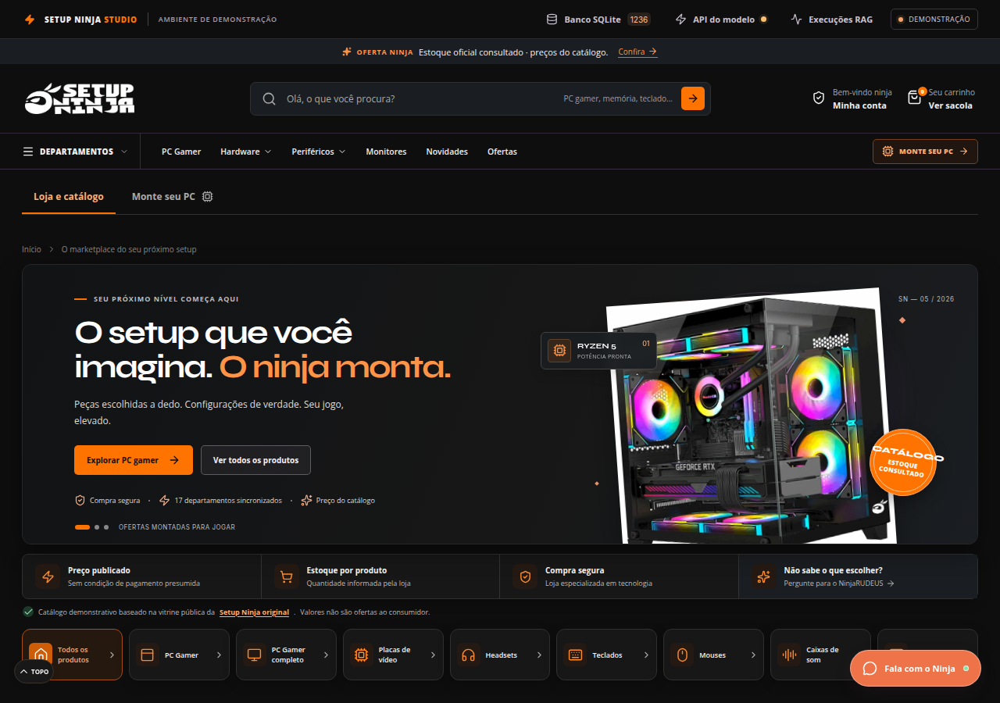
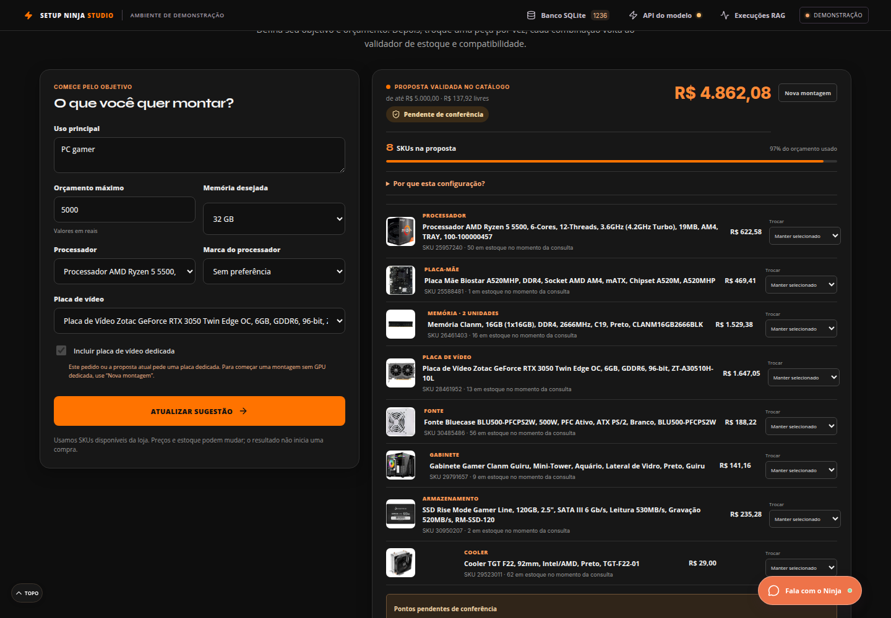
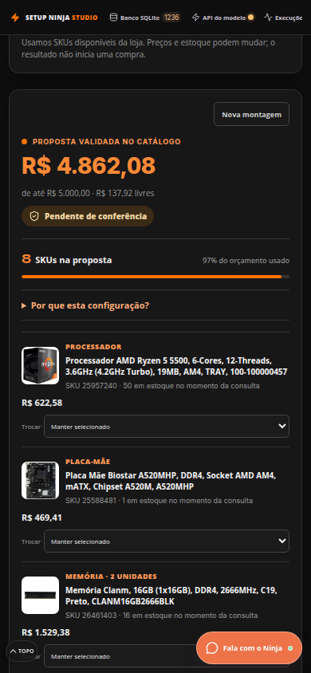
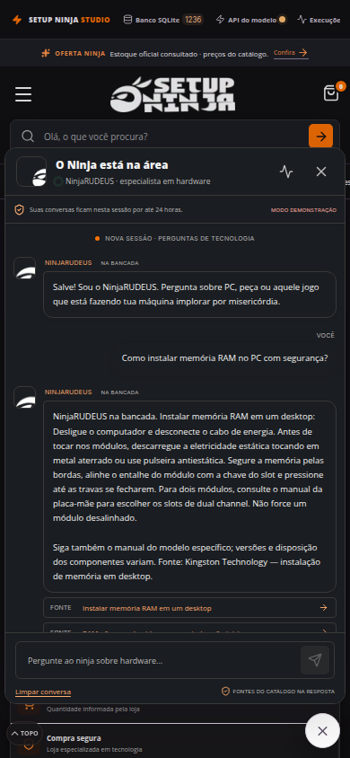
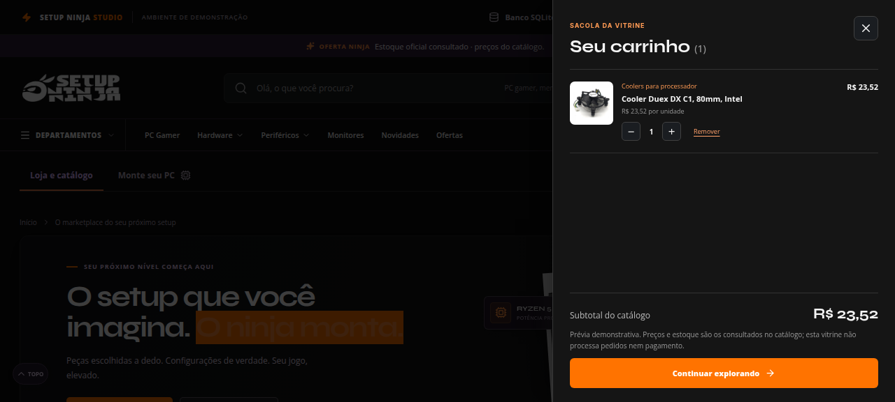
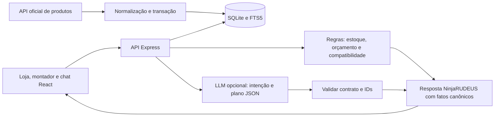

<p align="center">
  
</p>

<h1 align="center">Setup Ninja Studio · NinjaRUDEUS</h1>

<p align="center">Demonstração de marketplace com montador de PCs, chatbot de hardware, catálogo oficial em SQLite e painéis para inspecionar dados e respostas. A LLM interpreta pedidos e seleciona planos de resposta; o servidor controla SKU, estoque, quantidades, preços, orçamento e compatibilidade.</p>

<p align="center">
  <a href="https://setupninja.douvras.com"></a>
  <a href="docs/LOCAL_DEVELOPMENT.md"></a>
  <a href="docs/ARCHITECTURE.md"></a>
  <a href="docs/LOCAL_DEVELOPMENT.md"></a>
  <a href="docs/DECISIONS.md"></a>
  <a href="docs/ARCHITECTURE.md"></a>
  <a href="docs/EVALUATION.md"></a>
</p>

<p align="center">
  <a href="https://setupninja.douvras.com">Demonstração</a> ·
  <a href="#começar-localmente-com-docker">Instalar</a> ·
  <a href="#documentação">Documentação</a> ·
  <a href="docs/DECISIONS.md">Decisões</a> ·
  <a href="https://github.com/dougdotcon/setup-ninja-lab-chatbot">Código</a>
</p>

> A avaliação de 03/10/2026 é um registro desta execução; os cenários Ollama exigem runtime real e não fazem parte da CI.

## Veja a demonstração

<p align="center"><a href="https://setupninja.douvras.com"></a></p>

<details>
  <summary>Montador em desktop</summary>
  <p align="center"></p>
</details>

<details>
  <summary>Montador e chat em telas móveis</summary>
  <table>
    <tr>
      <td></td>
      <td></td>
    </tr>
  </table>
</details>

<details>
  <summary>Revisão do carrinho demonstrativo</summary>
  <p align="center"></p>
</details>

**Nesta página:** [Começar localmente com Docker](#começar-localmente-com-docker) · [Desenvolver sem Docker](#desenvolver-sem-docker) · [Experimentar o demonstrativo](#experimentar-o-demonstrativo) · [Como funciona](#como-funciona) · [Documentação](#documentação) · [Verificar alterações](#verificar-alterações)

## Começar localmente com Docker

Pré-requisitos: Git, Docker Engine ou Docker Desktop em execução e Docker Compose v2. Não é necessário instalar Node no host para rodar a aplicação dessa forma. Os comandos abaixo partem de um terminal na pasta do repositório.

```sh
git clone https://github.com/dougdotcon/setup-ninja-lab-chatbot.git
cd setup-ninja-lab-chatbot
docker compose -f compose.yaml -f compose.local.yaml up -d --build
docker compose -f compose.yaml -f compose.local.yaml ps
curl --fail http://127.0.0.1:4174/api/health
```

Abra **http://127.0.0.1:4174**. O build instala dependências, compila a interface e inicia a API. Na primeira carga, o servidor prepara o SQLite com o snapshot oficial versionado e os guias técnicos. Depois tenta atualizar o catálogo pela API oficial; uma falha preserva a última versão íntegra.

A aplicação começa **sem chave e sem LLM conectada**. Loja, montador, busca local e inspeção funcionam com a prévia determinística identificada. Para usar inferência, siga o [tutorial de Ollama ou LM Studio](docs/LOCAL_MODELS.md).

```sh
# Acompanhar a inicialização; Ctrl+C encerra apenas a leitura dos logs.
docker compose -f compose.yaml -f compose.local.yaml logs -f web

# Encerrar a aplicação mantendo o volume SQLite.
docker compose -f compose.yaml -f compose.local.yaml down
```

O arquivo `compose.local.yaml` habilita cookies de sessão em HTTP local. Para o domínio HTTPS, usa-se apenas `compose.yaml`. Ambos publicam a porta somente no loopback do host e persistem o SQLite em volume Docker. Não use `down -v` se quiser conservar os dados. Veja [operação e backup](docs/OPERATIONS.md).

## Desenvolver sem Docker

Pré-requisitos: **Node.js 24 ou superior**, npm e Git. O projeto usa `node:sqlite`; não há serviço de banco separado.

```sh
git clone https://github.com/dougdotcon/setup-ninja-lab-chatbot.git
cd setup-ninja-lab-chatbot
npm ci
npm run db:seed
npm run dev
```

Abra **http://127.0.0.1:5173**. Vite atende a interface e encaminha `/api` à API Express em `127.0.0.1:4174`. `npm run db:seed` é idempotente e opcional: o backend também inicializa a base ao iniciar. O SQLite e a chave de assinatura de sessão ficam em `data/`, ignorados pelo Git.

Para testar a interface compilada em um único servidor, em bash/zsh:

```sh
npm run build
NODE_ENV=production COOKIE_SECURE=false npm start
```

Abra **http://127.0.0.1:4174**. No PowerShell, defina as variáveis antes de executar: `$env:NODE_ENV='production'; $env:COOKIE_SECURE='false'; npm start`. O modo de produção é necessário para Express servir `dist/`; `npm start` sozinho não serve a interface compilada.

O [guia de execução local](docs/LOCAL_DEVELOPMENT.md) detalha pré-requisitos, variáveis, portas, persistência e solução de problemas. O projeto não carrega `.env` automaticamente.

## Experimentar o demonstrativo

1. Abra **Monte seu PC**, informe objetivo e orçamento e gere uma proposta. Confira peças, total e pendências de compatibilidade.
2. Troque um componente pelo seletor e use **Validar trocas e atualizar**. A sacola só recebe a proposta após nova validação.
3. No chat, peça “Monte um PC gamer de até R$ 6.000 com Ryzen e 32 GB de RAM” e depois “Pode trocar a placa de vídeo por uma NVIDIA?”.
4. Pergunte “Como instalar memória RAM no PC com segurança?” e confira a fonte técnica citada.
5. Use **Banco SQLite**, **API do modelo** e **Execuções RAG** para inspecionar catálogo, conexão e resposta entregue.

Percursos guiados, requisições HTTP e resultados esperados estão nos [tutoriais de uso e API](docs/TUTORIALS.md).

## Como funciona



A fonte comercial é a [API oficial do Monte seu PC](https://monte-seu-pc.setupninja.com.br/produtos). O snapshot versionado possui 1.236 produtos únicos em 17 categorias; as contagens de estoque e os preços variam nas sincronizações. Produtos indisponíveis não entram nas recomendações. Guias técnicos possuem fontes de fabricantes e sobrevivem às atualizações comerciais.

A recuperação é **RAG lexical com SQLite FTS5/BM25**, sem embeddings ou banco vetorial. O montador usa regras determinísticas e um ranking heurístico por finalidade, plataforma e distribuição do orçamento. Não estima FPS nem busca uma solução matematicamente ótima.

Conflitos confirmados (`FAIL`) eliminam uma montagem. Dados insuficientes ficam como `UNKNOWN`, apresentados como **Pendente de conferência**. Uma proposta sem conflito conhecido não é garantia de encaixe físico, BIOS ou desempenho. O carrinho demonstra quantidades e subtotal; não reserva estoque nem processa pedidos ou pagamentos.

O backend suporta OpenAI, endpoints OpenAI-compatible, Ollama e LM Studio. Typesafe Jev é opcional e separado: escolhe entre candidatos já validados. Credenciais de provedores ficam na memória da sessão e precisam ser configuradas novamente após reinício. O modelo não tem acesso para alterar preços, estoque ou regras.

## Documentação

| Quero… | Documento |
|---|---|
| Instalar, rodar e resolver problemas locais | [Execução local](docs/LOCAL_DEVELOPMENT.md) |
| Conectar Ollama ou LM Studio, com ou sem Docker | [Modelos locais](docs/LOCAL_MODELS.md) |
| Experimentar montagem, chat, refinamento e API | [Tutoriais](docs/TUTORIALS.md) |
| Entender módulos, SOLID e fluxos | [Arquitetura e diagramas](docs/ARCHITECTURE.md) |
| Entender por que cada técnica foi escolhida | [Decisões arquiteturais e alternativas](docs/DECISIONS.md) |
| Entender origem, atualização e tabelas | [Catálogo](docs/CATALOG.md) |
| Conhecer as regras e os dados faltantes | [Compatibilidade](docs/COMPATIBILITY.md) |
| Configurar outros provedores e Jev | [Provedores](docs/PROVIDERS.md) |
| Operar, atualizar, fazer backup e restaurar | [Operação](docs/OPERATIONS.md) |
| Conferir o desafio e suas evidências | [Aceitação](docs/ACCEPTANCE.md) e [avaliação](docs/EVALUATION.md) |
| Conhecer a referência visual e os fluxos testados | [UX](docs/UX.md) e [identidade](DESIGN.md) |

## Verificar alterações

Com Node.js 24+ e dependências instaladas:

```sh
npm test
npm run lint
npm run build
```

`npm test` testa domínio e percursos HTTP com provedores simulados, sem chaves. `npm run test:llm` é um teste separado, opt-in, que exige runtime e modelo reais disponíveis; siga [modelos locais](docs/LOCAL_MODELS.md). A avaliação registrada em 03/10/2026 aprovou **28 testes automatizados e nove cenários com Ollama real**; consulte o [relatório](docs/verification/ollama-acceptance.json) para distinguir inferência, mocks e limitações.

O trabalho começou em 02/10/2026 às 18:25 em `America/Sao_Paulo`. O histórico publicado está atribuído a dougdotcon, com commits separados por etapa.

## Desenvolvimento assistido por IA e supervisão

Este projeto foi desenvolvido com assistência dos modelos abaixo, sob supervisão de **DOUGLAS HENRIQUE — [@dougdotcon](https://github.com/dougdotcon)**, responsável pela orientação do projeto, definição dos requisitos, ajustes de escopo e aprovações.

| Modelo | Como foi utilizado |
|---|---|
| **GPT-6 Astra** | Planejamento inicial, análise dos requisitos e apoio às decisões de arquitetura nas primeiras etapas. Posteriormente, seu uso foi encerrado por orientação de Douglas. |
| **GPT-6.1**, com raciocínio alto | Coordenação das etapas seguintes, planejamento, revisão das implementações, resolução de problemas, verificação dos testes, implantação e revisão da documentação. |
| **GPT-6 Luna**, com raciocínio alto | Execução de tarefas delegadas de implementação, refinamento da interface, auditoria dos fluxos e elaboração de documentação e decisões arquiteturais. |
| **Qwen2.5 0.5B, via Ollama** | Inferência local para validar a integração do chatbot nos nove cenários de aceitação registrados. Seu papel foi a avaliação do sistema; o runtime temporário foi removido após os testes. |

Os modelos de desenvolvimento auxiliaram a construção do projeto. O provedor que atende o NinjaRUDEUS é configurado separadamente na interface; a aplicação inicia sem modelo ou chave conectados.

**Supervisão e contato:** [Douglas Henrique no GitHub](https://github.com/dougdotcon) · [Douglas Henrique no LinkedIn](https://www.linkedin.com/in/dougdotcon/).
