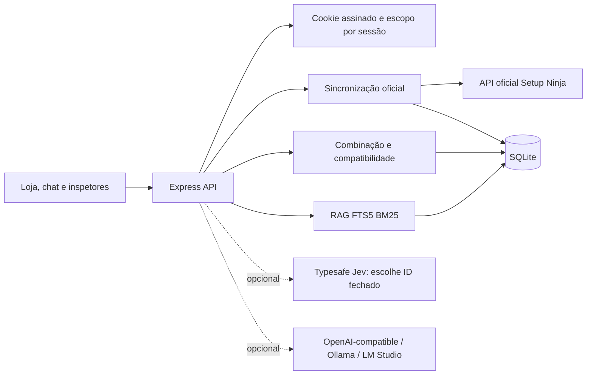
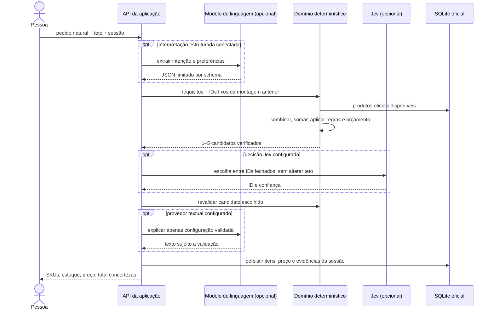

# Arquitetura do montador e do atendimento

## Componentes

O projeto separa interpretação explícita da frase (`shared/request.js`), normalização de catálogo (`server/domain/catalog.js`), regras de compatibilidade (`server/domain/compatibility.js`), geração/validação de montagens (`server/domain/build.js`), persistência SQLite (`server/database.js`) e rotas/transporte HTTP (`server/index.js`). As regras de domínio recebem objetos e não fazem chamadas de rede. O browser nunca decide compatibilidade, total ou estoque. As rotas dependem das funções de domínio e de interfaces de dados do módulo SQLite; um novo provedor de texto não exige alterar a compatibilidade.

## Fluxo de montagem

## Contratos e limites

- `priceCents` e estoque vêm do catálogo oficial; IDs selecionados pertencem à lista em estoque. Quantidades são verificadas por SKU e por módulos de RAM.
- Compatibilidade retorna `PASS`, `FAIL` ou `UNKNOWN`. Falhas confirmadas removem uma opção; ausência de informação permanece visível e não vira aprovação.
- Preferências e orçamento são restrições do servidor. Propostas de Jev só aceitam IDs apresentados e passam pelas regras novamente. Jev seleciona, não gera resposta textual.
- O modelo de linguagem pode interpretar e explicar, mas não fornece os valores finais. A interface renderiza preços/IDs/estoque da resposta canônica do backend.
- Um refinamento referencia um build anterior da mesma sessão e tenta preservar os IDs das demais peças. Dependências que precisem mudar são reportadas.
- Sem teto declarado, a aplicação usa e divulga uma referência inicial de R$ 8.000 (R$ 15.000 para RTX/RX 5070–5090); a pessoa pode ajustar o orçamento. Uma impossibilidade sob teto informado produz recusa explícita.
- A classificação/score gamer é uma regra aproximada baseada em custo, sem benchmarks. Não há garantia de FPS, estabilidade elétrica ou montagem física.
- Sem chave/API conectada, o modo local responde deterministicamente; a interface o identifica como prévia.
- A resposta do LLM no chat passa por verificação de preços e modelos contra os trechos recuperados; uma saída não fundamentada usa o texto local. A checagem reduz alucinações evidentes, sem ser uma prova formal sobre texto livre.

## Estado e privacidade

SQLite persiste catálogo e montagens, mas histórico e evidências são filtrados pela sessão assinada. Chaves de provedor ficam somente em memória, sem valor inicial ou chave de exemplo. `/api/inspect` expõe catálogo read-only; endpoints de histórico nunca enumeram sessões de terceiros. A sincronização busca uma origem fixa HTTPS, valida o payload completo e limita sua frequência.

A trilha do operador combina dois registros da mesma sessão: `rag_runs` guarda pergunta, fontes, modo e resposta final; `pc_builds` guarda a solicitação, os SKUs oficiais, decisão, interpretação, geração e explicação final. O painel rotula cada caminho separadamente, pois uma montagem determinística não usa a busca FTS5. Instalações SQLite anteriores recebem as novas colunas por migração aditiva; execuções antigas sem texto continuam legíveis.
