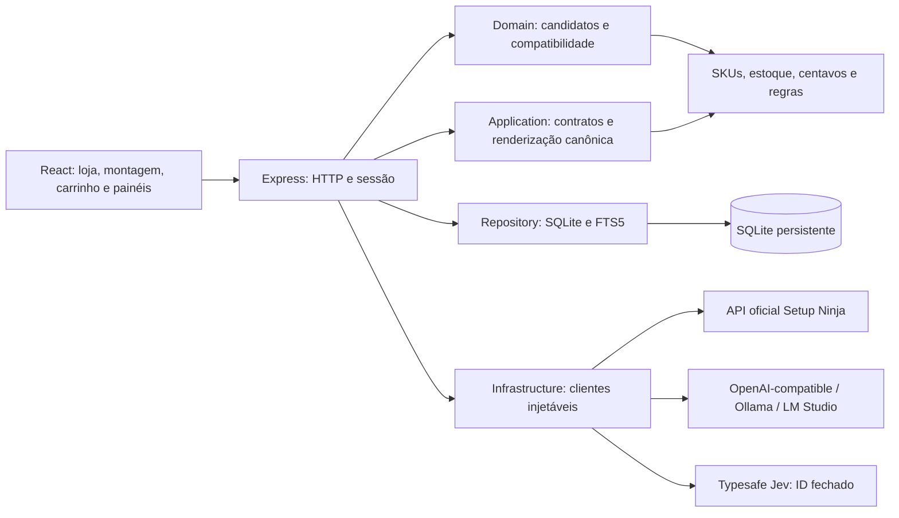
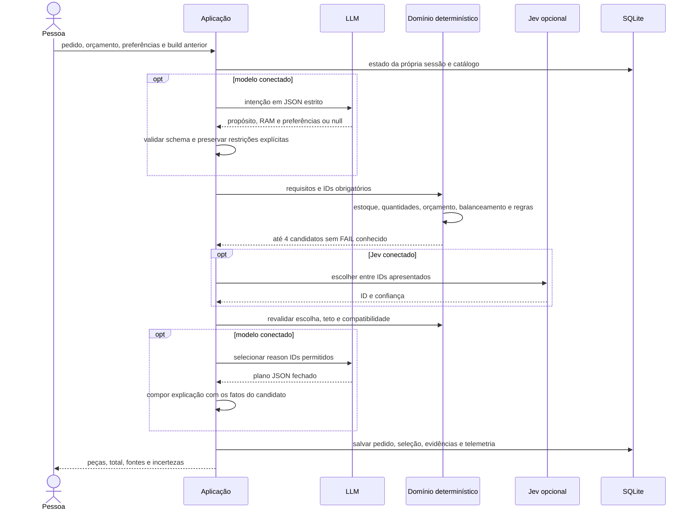

# Arquitetura do montador e do atendimento

As justificativas, alternativas, consequências e critérios de evolução estão em [DECISIONS.md](DECISIONS.md). Os diagramas abaixo descrevem a implementação atual; os [tutoriais locais](LOCAL_DEVELOPMENT.md) mostram como executá-la.

## Responsabilidades e SOLID

| Módulo | Responsabilidade |
|---|---|
| `shared/request.js` | Interpretar restrições explícitas e reconhecer pedidos de montagem no servidor e no browser. |
| `server/domain/catalog.js` | Normalizar a API oficial e deduplicar produtos. |
| `server/domain/compatibility.js` | Regras puras com `PASS`, `FAIL` e `UNKNOWN`. |
| `server/domain/build.js` | Gerar e pontuar candidatos, quantidades e orçamento. |
| `server/domain/hardware-guides.js` | Conhecimento editorial de hardware com fontes de fabricantes. |
| `server/application/assistant-policy.js` | Validar contratos da LLM, escopo, persona e compor respostas a partir de fatos autorizados. |
| `server/infrastructure/model-client.js` | Transporte OpenAI-compatible, timeout, validação de origem e parsing de resposta. |
| `server/infrastructure/official-catalog-client.js` | Consumir exclusivamente a origem oficial do catálogo. |
| `server/infrastructure/typesafe-jev.js` | Adaptar o protocolo Jev de decisão, com `fetchImpl` e timeout injetáveis. |
| `server/database.js` | Persistência, migrações, sessão, consulta SQL e índice FTS5. |
| `server/index.js` | Composição dos módulos e orquestração das rotas HTTP. |

SRP separa transporte, persistência, interpretação, política e regras. OCP permite adicionar um endpoint compatível sem mudar compatibilidade. Os adaptadores respeitam contratos limitados de interpretação, escolha e resposta; uma implementação substituta precisa produzir o mesmo contrato validado (LSP). Cada consumidor usa sua operação específica, sem receber um cliente universal para alterar preços (ISP). Domínio e policy não dependem de Express nem fazem rede; os clientes aceitam dependências de transporte para substituição nos testes (DIP). O entrypoint concentra a composição e a orquestração; não há um contêiner de injeção obrigatório.

## Fluxo da montagem

A LLM não devolve SKUs, preços ou compatibilidade que sejam usados como verdade. Na interpretação, campos ausentes são `null`; campos extras ou valores inválidos acionam fallback. Restrições explícitas e memória do pedido anterior prevalecem sobre sugestões da LLM. `requiredParts` registra IDs que precisam ser mantidos no refinamento; `refineTargets` registra categorias que a pessoa pediu para trocar, permitindo preservar os demais IDs e identificar dependências que precisem mudar. Restrições manuais explícitas não são relaxadas silenciosamente. Na explicação, o modelo escolhe até três motivos enumerados que já se aplicam ao candidato. No RAG, o modelo pode selecionar até quatro IDs entre as fontes recuperadas. Os schemas são estritos para OpenAI, Ollama e LM Studio; outros endpoints OpenAI-compatible recebem modo JSON e ainda passam pela validação exata no servidor. O servidor renderiza os nomes, quantidades, preços, total e avisos. Prosa arbitrária, promessa de FPS ou saída fora da persona não é renderizada como resposta.

## RAG e instruções de hardware

Produtos são recuperados do SQLite atualizado pela API oficial. Guias são resumos versionados de documentação primária de Kingston, AMD e Microsoft. Têm fontes próprias e não fingem ser SKUs. O seed dos guias é independente da sincronização comercial: atualizar o catálogo não apaga instruções de hardware. O plano da LLM usa apenas IDs recuperados; fatos comerciais e instruções vêm dos documentos autorizados. Comparação apresenta especificações publicadas e não inventa benchmarks.

Os filtros de categoria/orçamento/estoque são aplicados no SQL antes do limite de recuperação, evitando excluir uma opção barata porque itens caros ocuparam os primeiros resultados. FTS5 evita enviar todo o catálogo ao modelo. Para catálogos maiores, o próximo passo é medir recall, acrescentar filtros e índices segundo as consultas reais e usar sincronização incremental; busca vetorial ou reranking podem entrar como portas de recuperação sem alterar validação determinística. Atualmente o catálogo é sincronizado por snapshot completo e o gerador limita candidatos por categoria a quatro para manter tempo e contexto finitos.

## Contratos objetivos

- `priceCents`, SKU, estoque e atributos vêm da API. Quantidades de RAM contam unidades reais e capacidade publicada do kit.
- `FAIL` confirmado elimina uma montagem. `UNKNOWN` comunica um dado ausente; não é aprovação física, elétrica ou de BIOS.
- Refinamento só pode referenciar build da própria sessão. O servidor preserva IDs das outras peças quando possível e informa dependências alteradas.
- Sem teto informado, o servidor declara referência inicial de R$ 8.000, ou R$ 15.000 para pedidos RTX/RX 5070–5090. Nunca apresenta essa referência como orçamento do usuário.
- O ranking de equilíbrio é heurístico e considera classe/plataforma/custo e prioridade de GPU. Não estima FPS e não promete a configuração matematicamente ótima.
- Sem modelo conectado, a interface identifica a prévia determinística. Erro de modelo mantém os fatos canônicos e registra fallback.
- O timeout padrão é 60 s para Ollama/LM Studio locais e 25 s para provedores remotos. `SETUPNINJA_LLM_TIMEOUT_MS` aplica um valor configurável entre 5 e 120 s.

## Estado e privacidade

SQLite conserva catálogo, montagens e trilha por cookie de sessão assinado. `rag_runs` guarda pergunta, fontes e resposta entregue; `pc_builds` guarda pedido, SKUs, interpretação, decisão, geração e explicação. Migrações são aditivas. Uma captura embarcada antiga não substitui uma sincronização mais recente já persistida.

Chaves ficam em memória por sessão por até uma hora, sem armazenamento no SQLite ou browser. A inspeção pública é read-only e libera somente tabelas de catálogo; históricos são filtrados pela sessão. Chamadas remotas exigem HTTPS com proteção de origem/endereço; runtimes locais usam allowlist explícita. A importação do catálogo usa URL fixa, valida payload e limita frequência.
