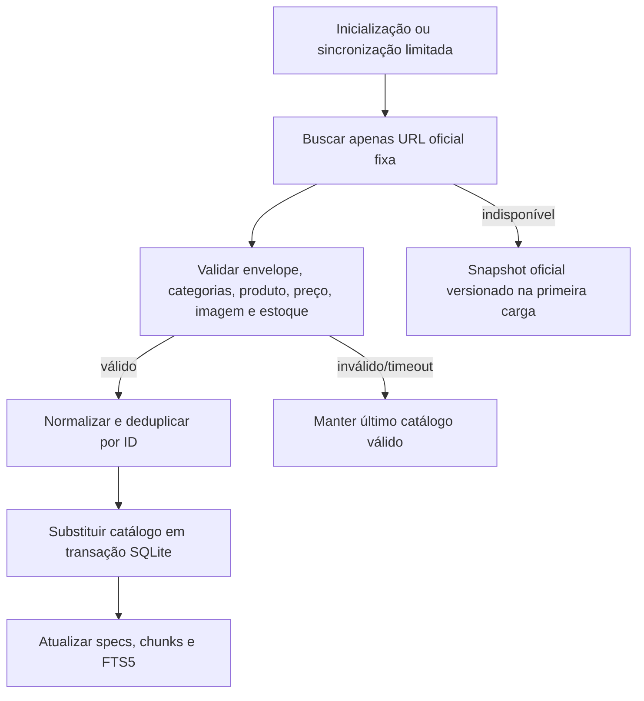

# Catálogo e atualização

## Fonte e fotografia dos dados

| Campo | Valor da captura versionada |
|---|---|
| URL | `https://monte-seu-pc.setupninja.com.br/produtos` |
| Captura informada | `2026-10-02T21:32:33.423Z` |
| Anúncios com estoque por categoria | 750 |
| Anúncios sem estoque por categoria | 488 |
| IDs únicos após deduplicação | 1.236 |
| Em estoque | 749 |
| Sem estoque | 487 |
| Categorias | 17 |

O número de anúncios por categoria soma 1.238 porque um produto pode estar relacionado a mais de uma categoria; a tabela `products` contém 1.236 IDs distintos. Fonte e SHA-256 aparecem em `data/catalog-api.snapshot-meta.json`. Os preços são preservados em centavos e os produtos podem aparecer no catálogo administrativo sem estoque; recuperação RAG e combinações filtram esses itens.

## Caminho de sincronização

A sincronização rejeita redirecionamentos, corpos grandes e payloads incompletos antes de substituir dados. A rota administrativa de sincronização é limitada globalmente a uma solicitação por minuto. Uma falha de atualização mantém o catálogo atual; numa primeira instalação, usa-se a cópia oficial versionada dentro da imagem. O backend registra execução, origem, contagens e resultado, sem credenciais.

## Uso

- `categories`, `products`, `product_categories` e `product_specs` contêm dados normalizados do configurador oficial.
- `knowledge_chunks` e `knowledge_fts` sustentam a busca local por produto e conteúdo tecnológico.
- `scrape_runs` contém sincronizações. `chat_sessions`, `chat_messages`, `rag_runs`, `pc_builds` e `pc_build_parts` guardam histórico operacional; rotas públicas leem esse histórico apenas na sessão atual.
- Imagens são URLs publicadas pela própria loja/CDN e não são reinterpretadas como evidência de especificação.
