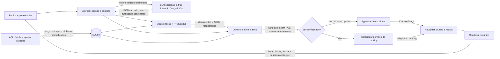

# Decisões de arquitetura

Este documento registra por que o Setup Ninja Studio foi montado dessa forma, as alternativas consideradas, os limites conhecidos e os sinais para rever cada escolha. Os fluxos de execução estão em [ARCHITECTURE.md](ARCHITECTURE.md); os passos completos para desenvolvimento e Docker estão no [README](../README.md), e a configuração de provedores locais está em [PROVIDERS.md](PROVIDERS.md).

## Reproduzir localmente

Use o [guia de execução local](LOCAL_DEVELOPMENT.md) para os passos completos. Em HTTP local, o Docker usa `docker compose -f compose.yaml -f compose.local.yaml up -d --build`. No desenvolvimento Node, use `npm ci`, `npm run db:seed` e `npm run dev`; no build de produção, defina `NODE_ENV=production` antes de `npm start`.

As diferenças de URL entre host, contêiner e máquina do visitante estão no [tutorial de modelos locais](LOCAL_MODELS.md). A aplicação não baixa modelos. Testes simulados e inferência real têm alcances distintos, descritos abaixo.

## Decisões

### Interface React/Vite e API Express no mesmo serviço

**Decisão.** Manter interface, API e domínio no mesmo repositório e ciclo de implantação. O Vite serve o frontend no desenvolvimento e produz os arquivos estáticos; o Express também entrega esses arquivos na execução de produção. O Compose sobe um contêiner Node único com a aplicação.

**Por quê.** A vitrine, o montador e o atendimento compartilham o mesmo catálogo, estado de sessão e regras. Um serviço reduz configuração local e permite que a interface use as mesmas rotas que o Docker publica.

**Alternativas e custo.** Separar frontend e API permitiria implantar e escalar cada parte independentemente, mas adicionaria origens, configuração e operações sem benefício necessário ao escopo atual.

**Limite e revisão.** O serviço é um monólito modular; o entrypoint Express ainda faz composição e coordena rotas. Reavaliar a separação se componentes precisarem de ciclos de implantação, escala ou fronteiras operacionais independentes.

### Docker multi-stage e volume separado da imagem

**Decisão.** Compilar React/Vite num estágio de build e copiar somente dependências de produção, backend, módulos compartilhados, snapshot e arquivos estáticos ao estágio final. O contêiner executa como `node`, com raiz read-only, tmpfs e volume gravável para SQLite. O override local altera o cookie para HTTP; o Compose base atende a implantação HTTPS.

**Por quê.** A imagem entrega frontend e backend do mesmo build; o volume mantém estado quando o contêiner é substituído. Separar dependências de desenvolvimento reduz o conteúdo necessário em runtime. Loopback no host permite que o proxy publique o serviço HTTPS sem expor diretamente a API em todas as interfaces.

**Alternativas e custo.** Instalar tudo diretamente no host simplifica edição, mas torna o ambiente mais dependente das ferramentas da máquina. Docker exige Engine/Desktop, rede e operação de volumes; não instala automaticamente Ollama ou LM Studio. A tag base `node:24-bookworm-slim` pode mudar ao longo do tempo; o lockfile fixa dependências npm, não o digest da imagem base.

**Limite e revisão.** Um healthcheck HTTP não avalia qualidade da LLM ou atualidade do catálogo. Para releases imutáveis, fixar digest, identificar a imagem por versão e testar restauração. Ao escalar instâncias, rever banco, armazenamento e configuração em memória antes de compartilhar o volume entre processos.

### Módulos funcionais, portas estreitas e composição no entrypoint

**Decisão.** Separar regras puras de domínio, política de aplicação, persistência e adaptadores de infraestrutura. Os clientes de rede aceitam transporte e dependências substituíveis nos testes. `server/index.js` compõe as implementações concretas e coordena HTTP; não há contêiner de injeção de dependências.

**Por quê.** Compatibilidade e montagem podem ser avaliadas sem rede ou Express. Adaptadores com operações específicas evitam entregar a cada módulo um cliente universal. A substituição continua possível quando outra implementação satisfaz o mesmo contrato validado.

**Alternativas e custo.** Um contêiner DI e camadas adicionais reduziriam a composição manual em uma aplicação maior, mas, hoje, criariam indireção e configuração sem resolver uma necessidade demonstrada. A composição concentrada também significa que o entrypoint cresce com novas rotas e fluxos.

**Limite e revisão.** SOLID orienta as fronteiras, mas não elimina acoplamento nem transforma o projeto em microserviços. Extrair composição ou adotar um contêiner quando o entrypoint deixar de ser legível ou as dependências exigirem ciclo de vida e configuração mais complexos.

### SQLite embutido, `node:sqlite` e FTS5 com BM25

**Decisão.** Guardar catálogo, especificações, documentos de conhecimento, sessões, montagens e execuções em SQLite. A busca textual usa FTS5 e BM25; filtros de categoria, estoque e teto são aplicados na consulta antes da seleção limitada de documentos.

**Por quê.** O catálogo e o conteúdo editorial cabem no processo e precisam de busca textual com filtros objetivos. SQLite reduz dependências de operação, mantém o estado em arquivo/volume e oferece transações. FTS5 usa índice local sem enviar todo o catálogo ao modelo.

**Alternativas e custo.** Um serviço de busca ou um índice vetorial poderia atender melhor a catálogos maiores ou consultas sem sobreposição de palavras, mas acrescentaria infraestrutura e medição que não existem aqui. Embeddings, vector RAG e reranking não estão implementados. A busca lexical pode deixar de encontrar sinônimos e paráfrases que não estejam cobertos pela normalização e expansão de termos atual.

**Limite e revisão.** Atualmente a atualização comercial substitui o snapshot completo e o montador limita candidatos por categoria; não há garantia de desempenho para crescimento indefinido. Meça consultas e recall com perguntas reais antes de adicionar índices, sincronização incremental ou outro mecanismo de recuperação. Considere vector search ou reranking somente se a evidência mostrar falhas lexicais relevantes.

### SQLite em WAL e migrações aditivas no processo

**Decisão.** Habilitar WAL, foreign keys e `busy_timeout=5000`; inicializar schema/migrações ao abrir o banco. O driver `DatabaseSync` usa operações síncronas dentro do processo Node.

**Por quê.** WAL mantém transações e permite coexistência de leitores com escrita; chaves estrangeiras ajudam a manter relacionamentos coerentes. Migrações aditivas permitem reusar o volume sem reconstruir o catálogo a cada release. O driver embutido evita compilar outro binding nativo na instalação.

**Alternativas e custo.** Um serviço PostgreSQL, um driver assíncrono ou workers teriam outros limites de concorrência, mas aumentariam componentes. Operações síncronas podem ocupar o event loop; WAL não cria múltiplos escritores simultâneos nem elimina o custo de uma sincronização grande.

**Limite e revisão.** Não há framework de migrações com rollback automático. Medir latência e contenção sob carga antes de ampliar o catálogo ou réplicas. Fazer backup com serviço parado, incluindo WAL/SHM quando presentes, e validar restauração; copiar somente o `.sqlite` durante escrita pode perder transações recentes.

### API oficial normalizada e substituição transacional do catálogo

**Decisão.** Buscar somente a URL fixa da API oficial do configurador, validar e normalizar seu payload, deduplicar produtos por ID e substituir catálogo e índices dentro de uma transação SQLite. A fotografia versionada é contingência para a primeira carga; uma atualização inválida ou indisponível preserva a versão íntegra já gravada.

**Por quê.** Preço, estoque, SKU e atributos comerciais precisam apontar para uma fonte identificável. Uma transação evita expor uma mistura de versões se a atualização falhar durante a gravação. Normalização aproxima o formato variável da API dos contratos internos.

**Alternativas e custo.** Scraping de páginas, várias fontes comerciais ou ingestão incremental poderiam ampliar cobertura, mas ampliariam a superfície de validação e criariam regras de precedência. A substituição completa é simples, mas refaz o trabalho de sincronização e pode ser mais custosa com um catálogo muito maior.

**Limite e revisão.** A fotografia representa o instante consultado e pode ficar desatualizada quando a origem está indisponível. Campos ausentes na API não são inferidos como fatos. Rever atualização incremental se volume e duração medidos justificarem, preservando validação, origem e atomicidade.

### Compatibilidade determinística em centavos e estados `PASS`, `FAIL`, `UNKNOWN`

**Decisão.** O domínio escolhe apenas produtos oficiais disponíveis, guarda valores monetários em centavos e aplica regras de compatibilidade explícitas. Uma incompatibilidade conhecida (`FAIL`) elimina a montagem; um dado insuficiente produz `UNKNOWN`, que é mostrado para revisão; `PASS` indica apenas que as regras disponíveis foram satisfeitas.

**Por quê.** Estoque, quantidades e total precisam ser reproduzíveis e conferíveis. Regras codificadas permitem revalidar candidatos independentemente da interpretação de texto ou da resposta do modelo.

**Alternativas e custo.** Deixar o modelo inferir encaixe, potência ou total reduziria lógica no backend, mas faria fatos e decisões dependerem de geração probabilística. Ao preferir regras verificáveis, o sistema fica conservador diante de atributos ausentes.

**Limite e revisão.** A API não publica dados suficientes para confirmar formato da placa e gabinete, versão/lista de suporte de BIOS, todos os conectores, interfaces e medições de desempenho. `UNKNOWN` não certifica encaixe físico, segurança elétrica ou funcionamento. Adicione uma regra somente quando houver dado estruturado com fonte e interpretação inequívoca.

### Ranking heurístico limitado, sem benchmarks

**Decisão.** Gerar um conjunto limitado de candidatos válidos e ordená-lo por custo e heurísticas de alocação de CPU/GPU para pedidos de jogos. Sem um seletor externo configurado, a primeira opção do ranking é usada.

**Por quê.** Uma regra determinística pode selecionar uma opção dentro do teto sem pedir à LLM que estime desempenho. Limitar os candidatos também mantém finitos o processamento e o contexto enviado a um seletor opcional.

**Alternativas e custo.** Benchmarks, otimização matemática ou modelos de performance poderiam comparar desempenho, mas não há dados comparáveis de FPS ou medições no catálogo. A heurística não prova que a configuração escolhida seja ótima.

**Limite e revisão.** O score usa preço, classes e atributos publicados; não mede FPS, ruído, consumo real ou custo-benefício de mercado. Recalibrar somente com dados de desempenho rastreáveis e uma avaliação de cenários. Não descrever a ordenação atual como benchmark.

### LLM como intérprete e seletora de contratos; aplicação como fonte de verdade

**Decisão.** A LLM pode transformar o pedido em preferências estruturadas e selecionar IDs dentro do contexto recuperado. Para montagens, o domínio gera e valida candidatos; a escolha externa opcional é limitada a IDs apresentados e passa por nova validação de teto e compatibilidade. O servidor monta a resposta final usando os registros e textos autorizados.

**Por quê.** Linguagem natural é útil para extrair intenção e escolher entre opções, mas SKUs, valores e regras precisam permanecer ligados ao catálogo e ao domínio. As validações permitem que um modelo seja substituído sem lhe conceder autoridade sobre fatos comerciais.

**Alternativas e custo.** Prosa livre dá mais flexibilidade de conversa, mas pode introduzir produtos, preços, especificações e promessas que não constam das fontes. Respostas estruturadas exigem schemas e renderização próprios e podem perder nuance.

**Limite e revisão.** Preferências mal interpretadas ou um resultado inválido levam a fallback local; modelo conectado não garante melhor decisão. Não há uso de tool calling para pesquisar ou alterar dados: os fluxos atuais enviam contexto delimitado e recebem contratos estruturados. Só ampliar a autoridade do modelo com fontes e validações explícitas.

### Schemas fechados e renderer canônico

**Decisão.** Contratos de interpretação, plano de chat e motivos de montagem exigem campos exatos, enums e IDs permitidos. O renderer em código gera persona, nomes, quantidades, preços, totais, fontes e avisos a partir de registros validados. Texto arbitrário de resposta do modelo não é exibido como resposta final nesses fluxos.

**Por quê.** Provedores compatíveis variam no suporte a JSON Schema. Pedir formato estruturado ajuda, mas a validação exata no servidor permanece necessária. Renderizar fatos no backend impede que uma saída inventada substitua valores oficiais.

**Alternativas e custo.** Prosa gerada pelo modelo seria mais natural e barata de compor, mas não oferece o mesmo vínculo auditável entre cada afirmação comercial e os dados consultados. O renderer limita estilos e explicações a textos previstos no código.

**Limite e revisão.** Um schema válido não assegura que a escolha semântica seja boa. Revise exemplos reais e fallback quando houver mudança de contrato; qualquer novo campo precisa de validação, fonte e texto canônico correspondentes.

### Refinamento contextual limitado à sessão

**Decisão.** Builds são associados a uma sessão identificada por cookie assinado. O refinamento recebe o ID de um build da própria sessão, mantém peças exigidas por ID (`requiredParts`), marca categorias que devem mudar (`refineTargets`) e informa dependências que precisaram ser alteradas.

**Por quê.** Pedidos como “troque a GPU e mantenha o restante” dependem do estado anterior. Associar o histórico à sessão evita aceitar IDs de builds de outra sessão e permite preservar a intenção sem confiar na memória informal da LLM.

**Alternativas e custo.** Tratar cada pedido como independente simplificaria o estado, mas perderia o significado de refinamentos. Uma conta persistente permitiria continuidade entre dispositivos, mas exigiria identidade e gestão de contas que este projeto não possui.

**Limite e revisão.** A sessão é temporária e não é uma conta de usuário. Uma troca pode exigir mudar peças dependentes; quando uma peça fixada não estiver mais disponível ou couber no limite, o servidor precisa sinalizar o resultado em vez de garantir preservação impossível. Rever se o produto exigir login, compartilhamento ou histórico durável entre dispositivos.

### Cookie assinado e configuração sensível em memória

**Decisão.** Identificar a sessão com cookie HttpOnly/SameSite Lax, assinado por HMAC; conservar a chave aleatória no diretório persistente. Usar `Secure` em HTTPS. Credenciais LLM permanecem em mapas de memória com expiração, enquanto fatos e trilha ficam no SQLite filtrados por sessão.

**Por quê.** A assinatura impede fabricar um identificador de sessão válido; guardar a chave evita invalidar todos os cookies numa troca de contêiner. Não persistir chaves de provedores simplifica a instalação sem um cofre de segredos e evita incluí-las no inspetor/backup.

**Alternativas e custo.** Login com conta e um cofre de segredos permitiriam continuidade entre dispositivos, mas adicionariam identidade e infraestrutura. Configuração apenas em memória exige reconectar depois do reinício e não é compartilhada entre réplicas. A assinatura não criptografa o banco nem constitui autenticação de usuário cadastrado.

**Limite e revisão.** O demonstrativo não possui autorização administrativa por conta; o inspetor é público e limitado a leitura. Históricos e backups ainda precisam de proteção. Adotar identidade, autorização e armazenamento de segredos apropriados se a aplicação passar a lidar com contas, pedidos ou operação multi-instância.

### Provedor OpenAI-compatible, allowlist local e Jev opcional

**Decisão.** O transporte de linguagem usa `/chat/completions` para OpenAI, endpoints OpenAI-compatible, Ollama ou LM Studio. Endpoints remotos exigem HTTPS e endereço público verificado; HTTP local é permitido apenas para Ollama/LM Studio e para origens explicitamente listadas em `SETUPNINJA_LOCAL_LLM_URLS`. Typesafe Jev é um adaptador separado e opcional para escolher entre IDs de candidatos fechados.

**Por quê.** Um contrato de transporte comum deixa a pessoa escolher provedor remoto ou runtime local sem mudar o domínio. A allowlist distingue acesso local deliberado de uma URL arbitrária. A separação de Jev deixa a montagem utilizável sem essa integração.

**Alternativas e custo.** Acoplar a um único provedor simplificaria capacidades específicas, mas reduziria substituibilidade. A compatibilidade OpenAI não garante suporte igual a schemas estritos; endpoints alternativos ainda são validados localmente. Jev acrescenta uma decisão remota e credencial própria, sem ser necessário para o caminho padrão.

**Limite e revisão.** Endpoints e modelos devem estar realmente disponíveis e cumprir o contrato esperado; o aplicativo não instala runtime ou modelo. Credenciais de linguagem e Jev ficam em memória por sessão, com expiração, e somem no reinício. Jev não escreve respostas de usuário e não houve chamada real sem credencial. Reveja allowlist e contratos quando houver novo runtime ou mudança de protocolo.

### Observabilidade de respostas entregues, sem registrar raciocínio interno

**Decisão.** Guardar a consulta, as fontes selecionadas, o texto entregue e metadados da execução, além dos campos estruturados de interpretação, seleção e geração associados a builds. O histórico é filtrado pela sessão. Não há armazenamento de cadeia de pensamento.

**Por quê.** É possível investigar quais fontes e respostas o sistema entregou, distinguir fallback de chamada aceita e corrigir falhas sem persistir raciocínio interno do modelo. Dados de sessão também permitem reconstruir refinamentos e totais apresentados.

**Alternativas e custo.** Guardar prompts completos, raciocínio ou tráfego bruto ampliaria os dados sensíveis e não é necessário para a trilha atual. Por outro lado, a trilha limitada não permite auditar conteúdo interno que não foi entregue.

**Limite e revisão.** Consultas e respostas ainda podem conter dados fornecidos pela pessoa; são redigidas e escopadas à sessão, mas não constituem anonimização. Revise campos e retenção se a telemetria mudar de finalidade. Não inferir qualidade do modelo apenas pela existência de uma execução registrada.

### Testes com dependências simuladas e validação real optativa

**Decisão.** Testes automatizados usam transportes injetados ou servidores HTTP simulados para controlar respostas, erros e contratos. Há também um script `npm run test:llm` optativo que exercita um runtime Ollama real quando configurado; o relatório em `docs/verification/ollama-acceptance.json` registra nove cenários aprovados nessa execução.

**Por quê.** Simulações tornam erros de schema, timeouts, fallback e casos adversariais reproduzíveis sem chave, rede ou disponibilidade do modelo. A execução real verifica uma dimensão diferente: se um runtime instalado consegue cumprir os fluxos estruturados.

**Alternativas e custo.** Usar somente chamadas reais tornaria a suíte variável e dependente de rede/modelo. Usar somente mocks não mostraria se um runtime real aceita os contratos. As duas verificações têm alcances distintos.

**Limite e revisão.** O relatório comprova aquela execução com aquele modelo e ambiente; não é benchmark nem garantia para outros modelos ou execuções. A cobertura não substitui verificação física, ensaio elétrico ou medição de desempenho. Atualize o relatório quando uma nova avaliação real for feita, sem apresentá-la como comportamento universal.

### Carrinho local como demonstração, sem comércio eletrônico

**Decisão.** O carrinho guarda uma seleção demonstrativa no frontend para revisar quantidades e totais. O servidor valida os itens do montador, mas não fecha pedido, reserva estoque, cobra nem processa pagamento.

**Por quê.** A interface demonstra descoberta de produtos e revisão da seleção sem sugerir que existe uma operação comercial concluída. Preço e disponibilidade continuam sendo referências do snapshot consultado.

**Alternativas e custo.** Checkout exigiria regras de estoque, pedido, pagamento, segurança e suporte que não fazem parte desta aplicação. O carrinho atual também não tem garantias de inventário.

**Limite e revisão.** Nenhuma ação do carrinho equivale a compra ou reserva. Rever esta decisão somente junto com integrações comerciais reais e seus fluxos operacionais.

## Fronteiras de decisão

O diagrama resume quem pode fornecer cada tipo de decisão e em que ponto a aplicação revalida o resultado:

