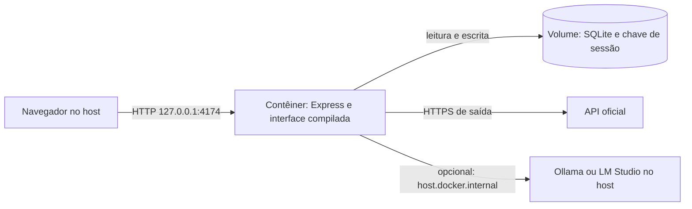
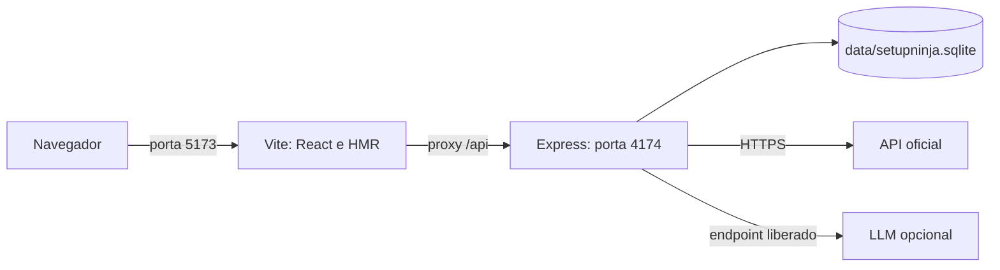

# Execução local e desenvolvimento

Este guia parte de um clone limpo. Para testar o produto sem editar código, use Docker. Para editar a interface/API com recarga automática, use Node diretamente. A instalação não exige chave de IA, Nginx, domínio ou servidor de banco separado.

## 1. Pré-requisitos e clone

| Caminho | Requisitos | Verificação |
|---|---|---|
| Docker | Git, Docker Engine/Desktop iniciado, Compose v2 | `git --version`, `docker version`, `docker compose version` |
| Node | Git, Node.js 24+, npm | `git --version`, `node --version`, `npm --version` |

```sh
git clone https://github.com/dougdotcon/setup-ninja-lab-chatbot.git
cd setup-ninja-lab-chatbot
```

Os comandos com atribuição de variável antes do programa usam bash/zsh, inclusive WSL ou Git Bash. No PowerShell, use `$env:NOME='valor'` e execute o programa na linha seguinte. Docker Desktop deve estar configurado para contêineres Linux.

## 2. Rodar com Docker em HTTP local

```sh
docker compose -f compose.yaml -f compose.local.yaml config
docker compose -f compose.yaml -f compose.local.yaml up -d --build
docker compose -f compose.yaml -f compose.local.yaml ps
curl --fail http://127.0.0.1:4174/api/health
```

Acesse `http://127.0.0.1:4174`. O health retorna JSON com `ok: true`; ele verifica o servidor HTTP, não garante conexão com uma LLM nem atualização recente do catálogo. Na primeira execução, aguarde o build terminar. A saúde do contêiner pode ficar `starting` antes de mudar para `healthy`.



Use os dois arquivos Compose em todos os comandos locais. O override altera somente `COOKIE_SECURE` para `false`, adequado ao HTTP local. O Compose base continua com cookie `Secure` para a instalação HTTPS. Não há exposição em `0.0.0.0:4174` no host: o mapeamento é somente loopback.

```sh
# Ver mensagens de inicialização e atualização do catálogo.
docker compose -f compose.yaml -f compose.local.yaml logs --tail=100 web

# Parar sem remover o volume.
docker compose -f compose.yaml -f compose.local.yaml down

# Iniciar novamente, recuperando a base do mesmo projeto Compose.
docker compose -f compose.yaml -f compose.local.yaml up -d
```

A primeira carga já cria schema, migrações, snapshot oficial e guias. Não rode `npm run db:seed` no host para preparar o volume Docker: são bancos em locais distintos.

## 3. Rodar com Node e recarga automática

```sh
npm ci
npm run db:seed
npm run dev
```

Abra `http://127.0.0.1:5173`. O script usa `concurrently` para iniciar Vite e `node --watch server/index.js`; Ctrl+C encerra ambos. Vite encaminha `/api` para Express, evitando configuração de CORS na interface. `db:seed` não busca a API na rede: prepara a base com o snapshot embarcado; o servidor, ao escutar, tenta a sincronização oficial em segundo plano.



Evite executar Node e Docker simultaneamente com a porta 4174 padrão. Se Vite iniciar em outra porta porque 5173 está ocupada, use o endereço indicado no terminal. A porta de destino do proxy da API continua fixa em 4174 em `vite.config.js`.

## 4. Rodar o build de produção com Node

```sh
npm ci
npm run build
NODE_ENV=production COOKIE_SECURE=false npm start
```

Abra `http://127.0.0.1:4174`. O processo Express serve a API e `dist/`. Alterações em React/CSS exigem novo build; não há HMR nesse modo. No PowerShell:

```powershell
$env:NODE_ENV='production'
$env:COOKIE_SECURE='false'
npm start
```

## 5. Variáveis reconhecidas pelo código

O servidor lê `process.env`; ele **não importa `.env` automaticamente**. Exporte as variáveis no terminal, use a sintaxe do PowerShell ou forneça um override Compose. Alterar o ambiente do host não substitui automaticamente os valores escritos em `compose.yaml`.

| Variável | Padrão sem Docker | Uso |
|---|---|---|
| `NODE_ENV` | Ausente: modo de desenvolvimento | `production` faz Express servir `dist/` e emitir CSP. |
| `HOST` | `127.0.0.1` | Interface de escuta da API. No contêiner: `0.0.0.0`. |
| `PORT` | `4174` | Porta da API. Se alterar no dev, ajuste também o proxy Vite. |
| `COOKIE_SECURE` | Ausente: `false` | `true` em HTTPS; `false` para HTTP local. |
| `SETUPNINJA_DATA_DIR` | `data/` do repositório | Diretório do SQLite, arquivos WAL/SHM e `session-signing.key`. Precisa permitir escrita. |
| `SETUPNINJA_LOCAL_LLM_URLS` | Lista vazia | URLs locais permitidas, separadas por vírgula, incluindo `/v1`. |
| `SETUPNINJA_LLM_TIMEOUT_MS` | 60.000 local / 25.000 remoto | Limite por chamada; valor positivo limitado a 5.000–120.000 ms. |
| `SETUPNINJA_SKIP_LIVE_SYNC` | Ausente | `1` desativa a busca automática na inicialização; não desativa a rota manual de sincronização. Útil para reprodução com snapshot. |

Exemplo bash para manter dados separados e permitir os dois runtimes no host:

```sh
SETUPNINJA_DATA_DIR="$PWD/../setupninja-local-data" \
SETUPNINJA_LOCAL_LLM_URLS=http://127.0.0.1:11434/v1,http://127.0.0.1:1234/v1 \
npm run dev
```

O exemplo mantém os dados fora do clone. O `.gitignore` cobre o caminho padrão em `data/`; diretórios personalizados precisam ser mantidos fora dos commits.

## 6. Persistência e funcionamento sem internet

O snapshot JSON oficial é versionado; o SQLite gerado não é. A base é inicializada automaticamente. Ao iniciar, a API tenta atualizar da origem oficial; uma atualização inválida ou indisponível conserva os dados anteriores. Um snapshot embarcado mais antigo não sobrescreve a sincronização persistida mais recente.

Depois de baixar dependências/imagens, é possível usar busca e montagem sobre o snapshot sem conexão à API. As fotos CDN e fontes do Google podem depender de internet. Inferência remota depende do provedor; inferência local depende do runtime acessível. O modo sem modelo é uma prévia determinística, não uma chamada de LLM.

O arquivo `session-signing.key` mantém a assinatura dos cookies após reinício. A configuração de modelo fica em memória e se perde ao reiniciar. Catálogo e histórico persistem no SQLite; o histórico é exposto somente à sessão e tem janela de 24 horas. O carrinho fica no armazenamento local do navegador, não nesse banco.

## 7. Problemas frequentes

| Sintoma | Conferir / resolver |
|---|---|
| `Cannot find ... node:sqlite` ou versão incompatível | Execute `node --version` e use Node 24+. Refaça `npm ci` com a versão correta. |
| Porta 4174 ocupada / `EADDRINUSE` | Encerre a outra instância local. No Docker, um override pode alterar somente a porta do host; mantenha a porta interna 4174. |
| `npm start` mostra orientação para Vite | Para servir o build, defina `NODE_ENV=production` e confirme que `npm run build` gerou `dist/`. |
| Docker não conecta ao daemon | Inicie Docker Desktop/Engine e confirme com `docker version`. |
| `EACCES`, SQLite read-only ou erro de chave | Confira permissões do diretório de dados; use o volume padrão. Evite executar seed/dev como root e depois como outro usuário sobre os mesmos arquivos. |
| Sessão/contexto some entre requisições | Use a mesma origem e preserve cookies; em HTTP local aplique `compose.local.yaml`. Em curl use `-c` e `-b` com o mesmo arquivo. |
| Modelo local retorna erro | Consulte [modelos locais](LOCAL_MODELS.md): URL, allowlist, `/v1`, ID instalado e alcance host/contêiner. |
| Catálogo não atualizou | Confira logs e origem no inspetor; a última base íntegra permanece. Não é necessário apagar SQLite para tentar sincronizar. |
| Resposta 429 | Aguarde a janela de um minuto. Montagens têm limite de cinco por sessão/endpoint; sincronização é global, uma por minuto. |
| Aviso experimental de SQLite | O Node usado pode emitir esse aviso; confira a versão e o resultado do comando. Não significa, por si só, falha do seed. |

Para operação do volume, backup e publicação HTTPS, consulte [OPERATIONS.md](OPERATIONS.md). Para os passos funcionais, consulte [TUTORIALS.md](TUTORIALS.md).

## Verificação destes passos

Os comandos foram reproduzidos em instalações isoladas, com build limpo, cookie HTTP, refinamento, interface e restauração de volume. Consulte o [registro de verificação](verification/local-setup.md) para ambiente, resultados e limites.
