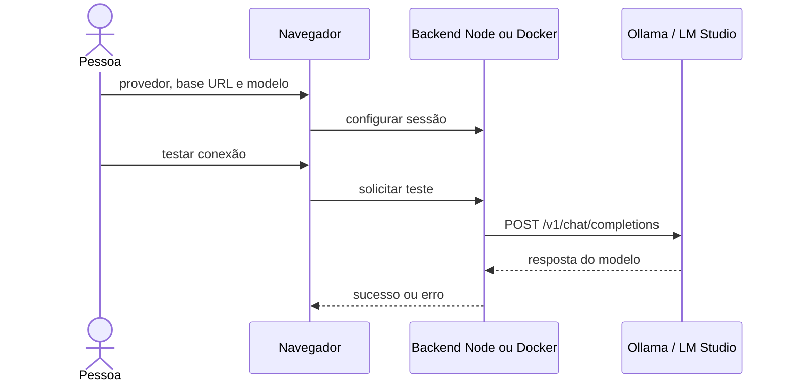

# Tutorial: Ollama e LM Studio locais

A aplicação envia chamadas ao runtime pelo **backend**, usando `POST /v1/chat/completions`. O navegador não chama Ollama/LM Studio diretamente. É necessário instalar um runtime, baixar/carregar um modelo e permitir que a API da aplicação alcance esse runtime. Nenhum deles é instalado pelo Compose do projeto.

## Escolher a URL correta

| Onde a aplicação roda | Onde o runtime roda | Base URL na interface | Configuração do backend |
|---|---|---|---|
| Node diretamente no computador | Mesmo computador | `http://127.0.0.1:11434/v1` ou `http://127.0.0.1:1234/v1` | Exportar a mesma URL em `SETUPNINJA_LOCAL_LLM_URLS`. |
| Docker no computador | Host desse Docker | `http://host.docker.internal:11434/v1` ou `http://host.docker.internal:1234/v1` | Ambas já estão no Compose; runtime precisa aceitar conexão do contêiner. |
| Servidor Douvras | Notebook do visitante | `localhost` do notebook não é alcançável pelo servidor | Rode o projeto no notebook ou configure um endpoint HTTPS público autenticado controlado por você. |



O código aceita HTTP local apenas para os provedores `ollama`/`lmstudio`, em `127.0.0.1`, `localhost` ou `host.docker.internal`, com URL exata na allowlist. Inclua `/v1`; não coloque `/chat/completions` na base, pois o cliente acrescenta essa rota. Para outro provedor, use o adaptador OpenAI-compatible com HTTPS público e credencial.

## 1. Ollama com aplicação Node no host

Instale o Ollama conforme o [quickstart oficial](https://docs.ollama.com/quickstart). Este exemplo usa `qwen2.5:0.5b`, o modelo pequeno utilizado na avaliação de integração; escolha outro ID disponível se quiser avaliar qualidade superior.

```sh
ollama pull qwen2.5:0.5b
ollama list
curl --fail http://127.0.0.1:11434/v1/models
```

O runtime precisa estar iniciado. Se sua instalação não inicia o servidor automaticamente, rode `ollama serve` em outro terminal; não inicie dois servidores na mesma porta. O Ollama expõe a interface [OpenAI-compatible](https://docs.ollama.com/api/openai-compatibility); o runtime local sem autenticação não exige chave nesta aplicação.

Na pasta do projeto, inicie o backend com a URL permitida:

```sh
SETUPNINJA_LOCAL_LLM_URLS=http://127.0.0.1:11434/v1 npm run dev
```

No PowerShell:

```powershell
$env:SETUPNINJA_LOCAL_LLM_URLS='http://127.0.0.1:11434/v1'
npm run dev
```

Abra `http://127.0.0.1:5173`, clique **API do modelo** e informe:

| Campo | Valor |
|---|---|
| Provedor | Ollama |
| Base URL | `http://127.0.0.1:11434/v1` |
| Modelo | `qwen2.5:0.5b`, exatamente como instalado |
| Chave | Vazia para runtime local sem autenticação |

Conecte e use **Testar conexão**. Depois faça um pedido de montagem e confira **Execuções RAG**. O teste de conexão confirma uma chamada simples; o pedido real confirma os contratos estruturados e pode acionar fallback se o modelo responder incorretamente.

## 2. Ollama no host com aplicação em Docker

Inicie a aplicação com os dois arquivos locais:

```sh
docker compose -f compose.yaml -f compose.local.yaml up -d --build
```

No painel, use `http://host.docker.internal:11434/v1`. Em Linux, o Compose define `host-gateway` para resolver esse nome. O Ollama normalmente escuta somente em loopback; conforme a rede do host, isso pode impedir a conexão pelo contêiner. A [FAQ oficial](https://docs.ollama.com/faq) descreve `OLLAMA_HOST` e sua configuração por sistema operacional.

Para um servidor Ollama iniciado manualmente em bash, depois de encerrar a instância anterior pelo mecanismo da instalação:

```sh
OLLAMA_HOST=0.0.0.0:11434 ollama serve
```

Esse bind aceita conexões além do loopback. Limite o acesso à rede privada necessária para Docker; não publique a porta do runtime na internet sem autenticação. Para instalações por serviço/aplicativo, configure a variável no serviço/aplicativo e reinicie conforme a documentação oficial, em vez de iniciar uma segunda instância.

Confirme o caminho a partir do contêiner da aplicação, sem instalar curl nele:

```sh
docker compose -f compose.yaml -f compose.local.yaml exec web \
  node -e "fetch('http://host.docker.internal:11434/v1/models').then(async r => { console.log(r.status, await r.text()); process.exit(r.ok ? 0 : 1); }).catch(e => { console.error(e.message); process.exit(1); })"
```

Se funcionar no host e falhar nesse comando, o problema é alcance de rede/bind/firewall, antes da interpretação do modelo. Se o endpoint responde mas o chat falha, confira o ID do modelo, suporte ao formato estruturado e timeout.

## 3. LM Studio

1. Instale LM Studio e baixe um modelo adequado ao hardware.
2. Carregue o modelo e abra a aba **Developer**.
3. Inicie o servidor com **Start server** e confira a porta; o exemplo deste projeto usa `1234`.
4. Consulte `http://127.0.0.1:1234/v1/models` e copie o `id` retornado para o campo de modelo.
5. Se a aplicação estiver no Docker, configure **Serve on Local Network** para que o host aceite a conexão do contêiner e restrinja o acesso à rede necessária.

Esses controles estão descritos no [guia de servidor](https://lmstudio.ai/docs/developer/core/server) e nas [configurações oficiais](https://lmstudio.ai/docs/developer/core/server/settings). A aplicação usa os [endpoints OpenAI-compatible do LM Studio](https://lmstudio.ai/docs/developer/openai-compat).

Para Node direto, inicie o projeto com:

```sh
SETUPNINJA_LOCAL_LLM_URLS=http://127.0.0.1:1234/v1 npm run dev
```

No painel selecione **LM Studio**, base `http://127.0.0.1:1234/v1` e o ID real. No Docker, a base é `http://host.docker.internal:1234/v1`, já liberada no Compose. Deixe a chave vazia se o runtime não exigir autenticação; se exigir, informe a credencial do próprio runtime. Alterar a porta exige ajustar a base e a allowlist do backend.

## 4. Conferir interpretação, fallback e desconexão

O backend envia JSON Schema aos provedores Ollama e LM Studio, depois valida a resposta independentemente. Um modelo pode responder à chamada simples e falhar no schema da montagem. Não basta observar texto no chat para concluir que a LLM participou: confira chamada, modo e fallback no painel de execuções.

Há duas chamadas possíveis na montagem: intenção e motivos autorizados da explicação. Cada uma tem timeout padrão de 60 s em endpoint local; uma máquina com CPU limitada pode levar mais tempo. O servidor mantém os fatos canônicos e identifica o fallback. O campo `SETUPNINJA_LLM_TIMEOUT_MS` permite ajuste limitado a 5–120 s por chamada; não acelera o runtime nem garante qualidade.

Use **Desconectar** para remover a configuração da sessão. Reiniciar a aplicação também remove as configurações em memória; o SQLite continua persistente. Não é necessário adicionar chaves a arquivos, commits ou imagens Docker.

## Executar a aceitação com inferência real

O script roda com **Node.js 24+ no host**, mesmo quando a aplicação está em Docker. Antes, instale dependências com `npm ci`, inicie a aplicação e o runtime e confirme o modelo. O teste busca e sincroniza o catálogo oficial: precisa de internet e modifica a base da instância escolhida. Prefira uma instância de avaliação. Aguarde a janela de um minuto se uma sincronização recente retornar 429.

Aplicação Node no mesmo computador:

```sh
SETUPNINJA_VALIDATE_APP_URL=http://127.0.0.1:4174 \
SETUPNINJA_VALIDATE_BASE_URL=http://127.0.0.1:11434/v1 \
SETUPNINJA_VALIDATE_MODEL=qwen2.5:0.5b \
SETUPNINJA_VALIDATE_PROVIDER=ollama \
SETUPNINJA_VALIDATE_REPORT=/tmp/setupninja-real-llm-report.json \
npm run test:llm
```

Aplicação em Docker no mesmo computador: mantenha `APP_URL=http://127.0.0.1:4174`, mas use `SETUPNINJA_VALIDATE_BASE_URL=http://host.docker.internal:11434/v1`, pois quem acessa o modelo é o backend. Para LM Studio, use `SETUPNINJA_VALIDATE_PROVIDER=lmstudio`, porta `1234` e o ID carregado. O caminho `/tmp` serve para POSIX; em Windows, forneça um caminho existente para o relatório.

As variáveis `SETUPNINJA_VALIDATE_*` configuram somente o script; não são configuração permanente do backend. Sem elas, o script aponta para a demonstração hospedada. Defina `APP_URL` explicitamente para testar a sua instalação local.

O teste confere os cenários literais, contexto, estoque, centavos, orçamento, guia citado e recusa fora do escopo. Exige interpretação e geração aceitas pelo runtime e diferencia fallback. O [relatório versionado](verification/ollama-acceptance.json) registra nove cenários aprovados com Ollama; LM Studio possui contrato testado com mocks, sem alegação de inferência real nessa avaliação.
