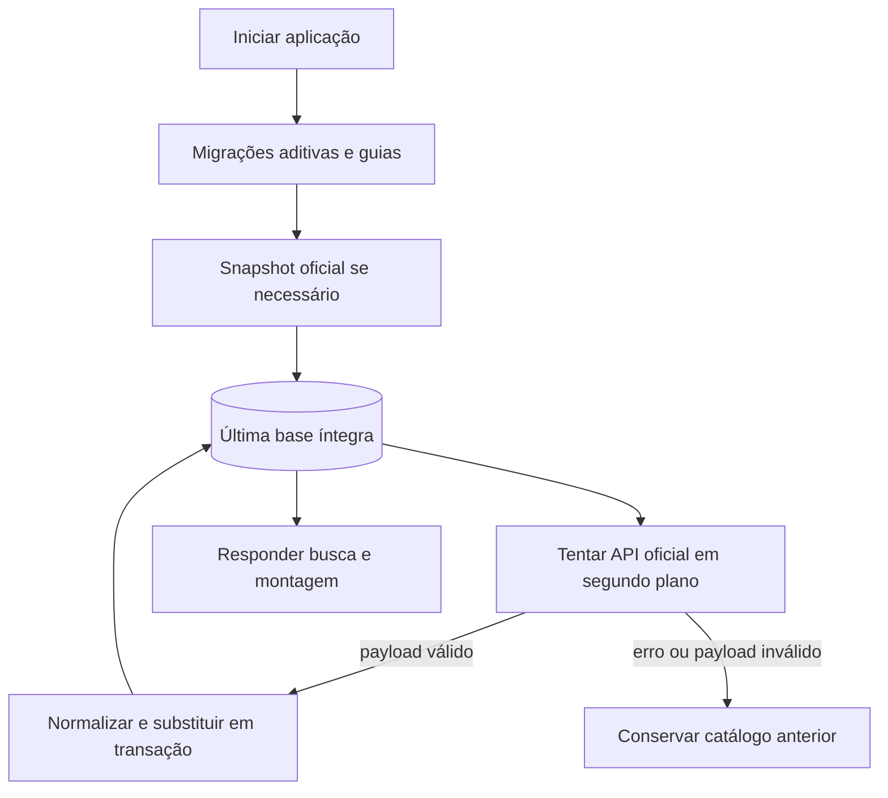
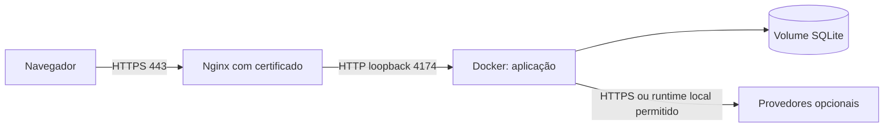

# Operação, persistência e publicação

## Escolher o ambiente

| Ambiente | Comando Compose | Acesso |
|---|---|---|
| Desenvolvimento/demo em HTTP local | `docker compose -f compose.yaml -f compose.local.yaml up -d --build` | `http://127.0.0.1:4174` |
| Servidor atrás de proxy HTTPS | `docker compose up -d --build` | Domínio HTTPS; cookie `Secure`. |

O Compose define um nome fixo de contêiner, `setupninja-demo`, e uma porta fixa no host. Dois clones não iniciam instâncias simultâneas sem overrides de nome/porta/imagem. Cada projeto Compose tem seu volume; confirme o volume em uso antes de copiar dados. O diretório do servidor publicado é `/apps/douvras/setupninja`; o nome do diretório de um clone local pode ser diferente.

## Atualizar uma instalação local

```sh
git pull --ff-only
docker compose -f compose.yaml -f compose.local.yaml up -d --build
docker compose -f compose.yaml -f compose.local.yaml ps
curl --fail http://127.0.0.1:4174/api/health
docker compose -f compose.yaml -f compose.local.yaml logs --tail=100 web
```

O volume mantém SQLite e a chave de sessão durante a troca do contêiner. Credenciais e configuração de modelo ficam em memória; reconecte pela interface após reinício. `git pull --ff-only` exige árvore limpa e histórico compatível; se houver edições locais, revise-as antes de atualizar.

## Dados persistentes

Dentro do contêiner, `/var/lib/setupninja` contém `setupninja.sqlite`, possíveis arquivos WAL/SHM e `session-signing.key`. A imagem executa como usuário `node`, com filesystem de raiz read-only, diretório temporário em tmpfs e volume de dados gravável.



Para atualizar manualmente a origem, use `POST /api/catalog/sync`. A rota tem limite global de uma chamada por minuto. O inspetor mostra data da captura e da sincronização. Não apague o banco para corrigir indisponibilidade temporária da API.

## Backup consistente do volume

Exemplo bash/zsh na pasta do clone. O arquivo de backup inclui dados e a chave de assinatura dos cookies; conserve-o com acesso restrito. Descubra o nome real do volume pelo contêiner em vez de presumir o prefixo da pasta:

```sh
ninja_volume=$(docker inspect setupninja-demo --format '{{range .Mounts}}{{if eq .Destination "/var/lib/setupninja"}}{{.Name}}{{end}}{{end}}')
test -n "$ninja_volume"
docker compose -f compose.yaml -f compose.local.yaml stop web
mkdir -p backups
docker run --rm \
  --mount "type=volume,source=$ninja_volume,target=/data,readonly" \
  --mount "type=bind,source=$PWD/backups,target=/backup" \
  alpine:3.22 tar czf /backup/setupninja-data.tgz -C /data .
docker compose -f compose.yaml -f compose.local.yaml start web
```

O serviço fica indisponível durante a cópia; parar o processo evita copiar apenas o arquivo SQLite enquanto transações estão no WAL. Se o comando de arquivo falhar, verifique o erro e reinicie o serviço. Na instalação HTTPS use o Compose base nos comandos `stop`/`start`. `backups/` está ignorado pelo Git, pois pode conter histórico de sessões.

## Restaurar em uma instalação sem dados

A restauração **substitui dados**. Faça backup do estado atual antes e use uma instância de destino parada, com volume vazio. Para criar o volume sem iniciar o serviço:

```sh
docker compose -f compose.yaml -f compose.local.yaml create web
ninja_volume=$(docker inspect setupninja-demo --format '{{range .Mounts}}{{if eq .Destination "/var/lib/setupninja"}}{{.Name}}{{end}}{{end}}')
test -n "$ninja_volume"
docker run --rm \
  --mount "type=volume,source=$ninja_volume,target=/data" \
  --mount "type=bind,source=$PWD/backups,target=/backup,readonly" \
  alpine:3.22 sh -c 'tar xzf /backup/setupninja-data.tgz -C /data && chown -R 1000:1000 /data'
docker compose -f compose.yaml -f compose.local.yaml up -d
curl --fail http://127.0.0.1:4174/api/health
```

Use somente arquivos de backup confiáveis. O exemplo de restauração pressupõe o UID/GID `1000` do usuário `node` na imagem atual; confira se modificar a imagem. A chave restaurada permite validar cookies anteriores, mas não restaura credenciais LLM, que nunca foram persistidas. Confirme catálogo e datas no inspetor após iniciar.

## Publicação HTTPS

O arquivo [deploy/setupninja.nginx](../deploy/setupninja.nginx) documenta o proxy da instalação Douvras. A aplicação continua escutando em `127.0.0.1:4174` no host. Domínio, DNS e certificado TLS são responsabilidades da implantação; não são necessários para execução local.



O modelo de Nginx tem `proxy_read_timeout 300s`, para cobrir chamadas sequenciais de interpretação e geração e o fallback. Cada chamada de modelo possui limite próprio no backend. Ao instalar ou alterar o proxy, valide com `nginx -t` antes de recarregar. Não copie paths de certificado sem criar os certificados do domínio de destino.

## Diagnóstico e limites operacionais

`/api/health` confirma o processo HTTP; `/api/session` mostra estatísticas e se a sessão tem modelo conectado. Logs do contêiner mostram inicialização e sincronização. A trilha de respostas é consultada pela interface e filtrada pelo cookie da sessão; não é um agregador público de todas as conversas.

O banco único atende o demonstrativo em um processo. Não há orquestração distribuída, fila, refresh automático por agendamento, checkout, reserva de estoque, autenticação de operador ou gestão de pedidos. A inspeção libera apenas leitura de tabelas selecionadas. Para uma operação maior, revise os [trade-offs e gatilhos de evolução](DECISIONS.md) antes de escalar réplicas que gravem no mesmo arquivo SQLite.
