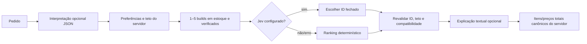

# Provedores de modelo

## Modelo de conversa

O backend implementa formato `POST {baseUrl}/chat/completions` compatível com OpenAI. Os provedores configuráveis são OpenAI, endpoint OpenAI-compatible, Ollama e LM Studio. Preencha base URL, nome de modelo e credencial quando o provedor remoto exigir. Ollama e LM Studio podem operar sem chave conforme sua instalação; um servidor em `localhost` no navegador do usuário **não** é o host do contêiner.

No Docker Compose os endereços iniciais são:

| Runtime | Base URL | Modelo de exemplo |
|---|---|---|
| Ollama no host Docker | `http://host.docker.internal:11434/v1` | `llama3.1` |
| LM Studio no host Docker | `http://host.docker.internal:1234/v1` | o ID exibido pelo servidor local |
| OpenAI | `https://api.openai.com/v1` | `gpt-4o-mini` |

O nome é apenas uma sugestão; configure um modelo realmente instalado/permitido no provedor. Para Ollama/LM Studio no host, o processo do modelo precisa ouvir na interface alcançável pelo Docker e a porta precisa estar liberada no host. A lista `SETUPNINJA_LOCAL_LLM_URLS` é allowlist da origem local: altere-a somente para um endereço que você controla. Não use um endereço `localhost` da máquina visitante para tentar alcançar outro computador; use VPN ou túnel privado seguro se o modelo estiver em outra máquina.

Os URLs remotos são HTTPS, sem redirects, com validação contra endereços privados. Chaves de conversa são guardadas na memória por sessão por até uma hora, sem persistência e sem log. Reinício do processo exige reconexão. A aplicação neste host não inclui API key nem executa runtime local de LLM.

## Typesafe Jev para escolha

Jev é um provedor de **decisão estruturada**, não de texto. A implementação envia `POST https://api.typesafe.ai/v1/systemone` com `Authorization: Bearer …` e corpo no formato `model`, `state` e `questions`. A pergunta `selection` é tipo `choice`; cada `criteria` contém um ID de build gerado pelo backend. Jev só escolhe uma dessas opções, e sua resposta esperada fica em `answers.selection.choice` e `confidence`.

O servidor valida que o ID está na lista fechada, confiança seja pelo menos `0,55`, o total não exceda o teto e todas as regras determinísticas continuem válidas. Um resultado desconhecido, baixa confiança, timeout ou erro usa ranking determinístico e é anotado como fallback. A credencial Typesafe fica isolada em memória da sessão por até uma hora. Para especificação atual, consulte a [API oficial Typesafe](https://docs.typesafe.ai/api).

## Duas etapas e fallback

Sem provedor de texto, a prévia local apresenta as peças selecionadas. Com modelo, o modelo pode interpretar e explicar, enquanto os fatos comerciais exibidos continuam sendo produzidos pelo backend. A aplicação não afirma que houve chamada externa a menos que a configuração e a telemetria da sessão confirmem isso.
