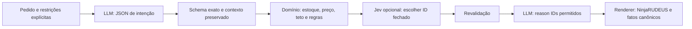

# Provedores e teste de modelo local

## Conexão por sessão

O backend usa `POST {baseUrl}/chat/completions`. OpenAI, Ollama e LM Studio recebem JSON Schema estrito quando o contrato é estruturado; outros endpoints OpenAI-compatible recebem modo JSON e todos os resultados passam por validação exata no servidor. A barra superior permite conectar OpenAI, endpoint OpenAI-compatible, Ollama ou LM Studio. Preencha o ID de um modelo realmente instalado/disponível. Nenhuma chave ou modelo fica conectado por padrão.

| Provedor | Base URL inicial | Credencial |
|---|---|---|
| Ollama no host Docker | `http://host.docker.internal:11434/v1` | Dispensável para runtime local sem autenticação. |
| LM Studio no host Docker | `http://host.docker.internal:1234/v1` | Conforme a configuração do servidor local. |
| OpenAI | `https://api.openai.com/v1` | API key da própria conta. |
| Outro OpenAI-compatible | Base HTTPS pública terminada em `/v1` conforme o provedor. | Conforme o provedor. |

O campo de modelo precisa receber o ID informado pelo runtime/provedor; os exemplos da interface não instalam modelos. Confirme conectividade com **Testar conexão** antes de conversar. Consulte as documentações oficiais de [Ollama](https://docs.ollama.com/api/openai-compatibility) e [LM Studio](https://lmstudio.ai/docs/developer/openai-compat).

O timeout padrão é de 60 s para endpoints locais e 25 s para remotos. `SETUPNINJA_LLM_TIMEOUT_MS` substitui o padrão com um valor entre 5.000 e 120.000 ms. Chaves ficam somente na memória da sessão por até uma hora. Desconectar ou reiniciar remove essa configuração. URLs remotas exigem HTTPS público, sem redirects nem parâmetros de autenticação no URL. Endpoints locais usam a allowlist `SETUPNINJA_LOCAL_LLM_URLS` do Compose.

## A máquina local e o contêiner

`localhost` no servidor da aplicação é diferente do `localhost` do visitante. No Compose, `host.docker.internal` aponta para o host onde Docker roda. O Ollama/LM Studio deve ouvir na interface que o contêiner consegue alcançar; mantenha a porta restrita ao host/rede privada da aplicação.

Para executar **todo o projeto na própria máquina**, rode `docker compose up --build -d` e configure a base do runtime local na interface. Em Linux, o Compose já declara `host.docker.internal:host-gateway`. Para um modelo na máquina do visitante enquanto a aplicação roda na Douvras, é necessário um túnel/proxy privado que exponha o runtime ao host Docker ou um endpoint HTTPS autenticado controlado por você. A aplicação hospedada não alcança automaticamente o notebook pelo endereço digitado `localhost`.

## Contratos, persona e fallback



Interpretação aceita propósito, memória e preferências limitadas, com `null` para dados ausentes. Explicação da montagem aceita até três motivos enumerados aplicáveis ao candidato. Chat RAG aceita modo/IDs recuperados/guia, no máximo quatro fontes selecionadas e sem prosa arbitrária. Os schemas usam enum e campos exatos; a aplicação valida novamente a resposta, inclusive quando o provedor só oferece modo JSON. O renderer usa informações da API e guias citados, mantendo a persona e os fatos fora do controle da LLM. Nos refinamentos, `requiredParts` guarda IDs que precisam permanecer e `refineTargets` identifica as categorias que devem mudar; as demais peças são preservadas quando possível e dependências alteradas são informadas. Falhas de schema, HTTP ou timeout acionam resposta local e são registradas. A interface informa se o modelo foi chamado e se houve fallback.

## Typesafe Jev

Jev decide entre candidatos; não é o runtime de conversa Ollama/LM Studio. O adaptador segue a [API oficial Typesafe](https://docs.typesafe.ai/api): `POST https://api.typesafe.ai/v1/systemone`, com `model`, `state` e pergunta `selection` do tipo `choice`. A credencial fica na memória da própria sessão.

A escolha usa `answers.selection.choice` e `confidence`. O servidor exige ID apresentado, confiança mínima de 0,55 e revalida teto e regras. Erro, ID inválido ou confiança insuficiente usam ranking determinístico. `tests/typesafe-jev.test.js` verifica o contrato por transporte injetado sem credencial real. Não houve chamada ao serviço Typesafe sem chave.

## Validação opt-in com inferência real

`npm test` usa um servidor HTTP simulado para executar casos inválidos e adversariais de maneira determinística. Esse teste não substitui inferência real. Para validar um runtime instalado sem chave:

```sh
SETUPNINJA_VALIDATE_APP_URL=https://setupninja.douvras.com \
SETUPNINJA_VALIDATE_BASE_URL=http://host.docker.internal:11434/v1 \
SETUPNINJA_VALIDATE_MODEL=qwen2.5:0.5b \
SETUPNINJA_VALIDATE_PROVIDER=ollama \
node scripts/verify-local-provider.mjs
```

Para LM Studio, use `SETUPNINJA_VALIDATE_PROVIDER=lmstudio`, base `http://host.docker.internal:1234/v1` e o ID carregado no servidor. O script conecta sessões temporárias, consulta a API oficial, valida SKUs/estoque/quantidades/centavos/tetos, executa os cenários literais do desafio e o refinamento NVIDIA preservando 32 GB. Também exige um guia RAG respondido pelo modelo e recusa fora do escopo após contexto técnico. Ao final desconecta cada sessão e salva `/tmp/setupninja-real-llm-report.json`, ou o caminho definido em `SETUPNINJA_VALIDATE_REPORT`.

O teste só passa se existir ao menos uma interpretação e uma geração estruturada aceitas pelo runtime real, além de todos os cenários canônicos aprovados. Um modelo pequeno pode acionar fallback nos demais casos; essa condição fica registrada, nunca é contada como resposta aceita do modelo. O relatório não contém cookies nem chaves. Runtimes temporários usados na avaliação são removidos ao fim; a aplicação permanece sem chave e sem modelo padrão.
