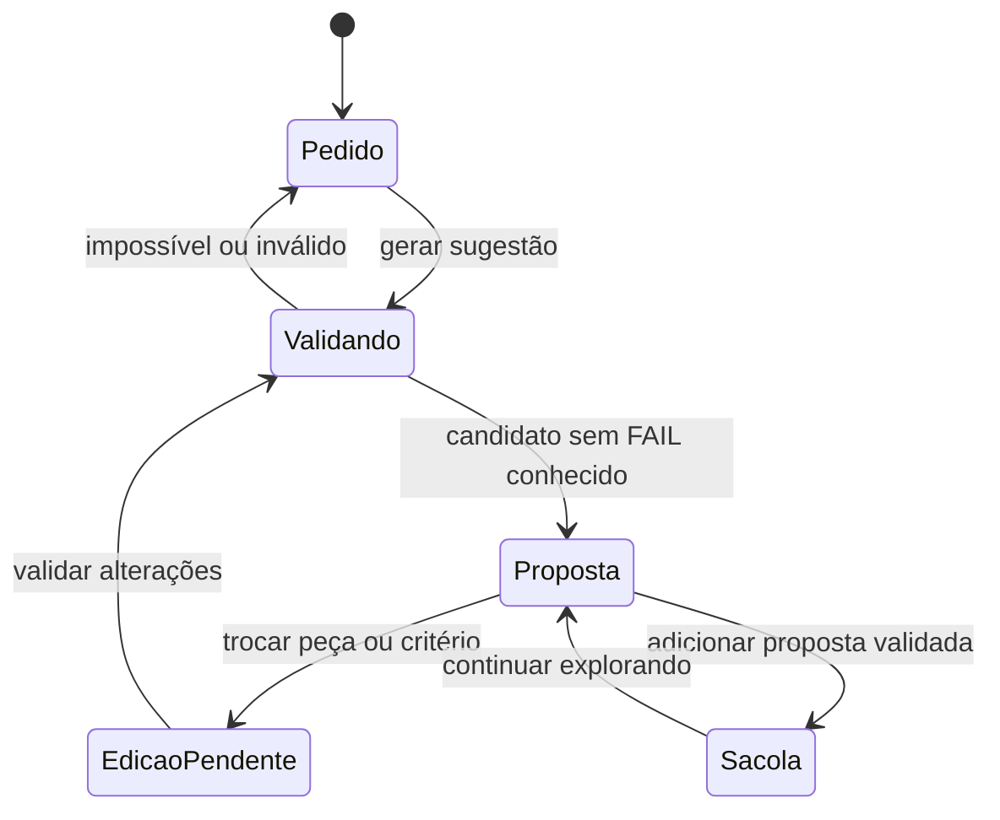

# Tutoriais de uso e API

Comece com a aplicação local em `http://127.0.0.1:4174` via Docker ou `http://127.0.0.1:5173` via Vite. Os exemplos HTTP usam a API direta em `http://127.0.0.1:4174`. Instalação: [execução local](LOCAL_DEVELOPMENT.md). Inferência: [modelos locais](LOCAL_MODELS.md).

## Tutorial 1 — montar um PC e revisar uma troca

1. Abra **Monte seu PC** na navegação ou na aba do celular.
2. Informe **PC gamer**, orçamento **5000** e memória **16 GB**. Gere a sugestão.
3. Confira total, saldo do orçamento, SKUs, quantidades e estoque no momento da consulta. O total deve ficar dentro do teto; valores dependem da sincronização atual.
4. Abra **Por que esta configuração?** e revise os **Pontos pendentes de conferência**. Ausência de informação não é compatibilidade garantida.
5. Escolha outro SSD pelo seletor **Trocar**. O resultado anterior continua identificado como a última proposta validada; a adição à sacola fica bloqueada até validar.
6. Clique **Validar trocas e atualizar**. Se a escolha for viável, revise a proposta atualizada; se não houver combinação, leia o motivo e ajuste a seleção ou orçamento.
7. Clique **Adicionar SKUs à sacola demonstrativa**. Confira o subtotal e a quantidade de módulos de RAM. A sacola não cria pedido nem reserva estoque.



## Tutorial 2 — conversar e refinar sem repetir o orçamento

No chat NinjaRUDEUS, envie:

> Monte um PC gamer de até R$ 6.000 com Ryzen e 32 GB de RAM.

Confira a proposta e depois envie:

> Pode trocar a placa de vídeo por uma NVIDIA?

O pedido se refere à proposta anterior da mesma sessão. O backend conserva teto, memória e restrições aplicáveis; tenta preservar as demais peças e informa dependências alteradas. Se não houver combinação em estoque, não deve inventar produto ou ignorar o teto.

Para testar impossibilidade, abra uma nova conversa e peça:

> Monte um PC com RTX 5070 de até R$ 5.000.

No catálogo da avaliação, esse pedido retornou impossibilidade por orçamento. O resultado futuro depende dos preços oficiais; o requisito é respeitar SKU, estoque e teto, não reproduzir um preço fixo.

## Tutorial 3 — instrução de hardware e escopo

Pergunte **Como instalar memória RAM no PC com segurança?**. O chat recupera um guia técnico e apresenta uma fonte, como Kingston. Mesmo após uma montagem anterior, uma instrução de instalação deve continuar no RAG e não gerar outro PC.

Depois pergunte **Qual é a melhor receita de bolo?**. O NinjaRUDEUS limita o atendimento ao contexto de tecnologia/hardware e não usa o modelo para esse pedido fora do escopo.

Sem provedor conectado, a interface identifica o modo local. Com provedor conectado, confira em **Execuções RAG** se o modelo foi chamado, o resultado da validação e eventual fallback. Uma falha do provedor não transforma informação inventada em fato autorizado.

## Tutorial 4 — inspecionar a origem da resposta

- **Banco SQLite:** mostra estatísticas, fonte da sincronização e tabelas de catálogo liberadas para leitura. Não permite executar SQL arbitrário nem editar estoque.
- **API do modelo:** conecta um provedor somente à sessão atual. Informe o ID disponível, teste a conexão e depois faça uma pergunta; nenhuma chave inicial é necessária para navegar no demonstrativo.
- **Execuções RAG:** mostra pergunta, fontes, modo, telemetria e resposta entregue; montagens mostram SKUs e explicação. Expanda os detalhes de resposta para ler o conteúdo registrado. Isso é trilha de atendimento, não raciocínio interno da LLM.

## Tutorial 5 — reproduzir uma montagem pela API

Em bash/zsh, instale `curl`. A API não usa chave própria para esses exemplos; o cookie identifica a sessão. Crie o arquivo de cookies num diretório temporário e conserve-o durante o refinamento:

```sh
ninja_cookie_file=$(mktemp)
curl --fail -c "$ninja_cookie_file" http://127.0.0.1:4174/api/session

curl --fail -b "$ninja_cookie_file" -c "$ninja_cookie_file" \
  -H 'Content-Type: application/json' \
  -d '{"request":"Monte um PC gamer de até R$ 6.000 com Ryzen e 32 GB de RAM."}' \
  http://127.0.0.1:4174/api/build
```

A resposta bem-sucedida inclui `buildId`, `selected`, `candidates`, `interpretation`, `generation` e `telemetry`. Em `selected.items`, os preços são centavos inteiros: `unitPriceCents × quantity = totalPriceCents`. A soma deve ser igual a `selected.totalPriceCents`. Use o `buildId` retornado no próximo comando, substituindo `ID_DA_MONTAGEM`:

```sh
curl --fail -b "$ninja_cookie_file" \
  -H 'Content-Type: application/json' \
  -d '{"request":"Pode trocar a placa de vídeo por uma NVIDIA?","previousBuildId":"ID_DA_MONTAGEM"}' \
  http://127.0.0.1:4174/api/build

curl --fail -b "$ninja_cookie_file" \
  -H 'Content-Type: application/json' \
  -d '{"message":"Como instalar memória RAM no PC com segurança?"}' \
  http://127.0.0.1:4174/api/chat

curl --fail -b "$ninja_cookie_file" http://127.0.0.1:4174/api/build/history
curl --fail -b "$ninja_cookie_file" http://127.0.0.1:4174/api/chat/runs
rm "$ninja_cookie_file"
```

Para examinar um erro esperado 422, use `curl -i` sem `--fail`, pois `--fail` omite o corpo em versões comuns do curl. O servidor não usa `previousBuildId` de outra sessão. Se fechar o navegador ou apagar cookies, não presuma que o histórico anterior estará acessível.

## Rotas úteis

| Método e rota | Finalidade |
|---|---|
| `GET /api/health` | Saúde HTTP do processo. |
| `GET /api/session` | Sessão, provedor configurado e estatísticas do banco. |
| `GET /api/catalog?q=ryzen&limit=10` | Consulta de catálogo. |
| `GET /api/build/options` | Opções por componente para o montador. |
| `POST /api/build` | Montar ou refinar com JSON e sessão. |
| `POST /api/chat` | Busca/atendimento RAG; campo `message`. |
| `GET /api/build/history` | Montagens da sessão. |
| `GET /api/chat/runs` | Execuções RAG da sessão. |
| `GET /api/inspect/tables` | Tabelas de catálogo permitidas. |
| `GET /api/inspect/table/products?limit=10` | Linhas paginadas de uma tabela autorizada. |
| `POST /api/catalog/sync` | Atualização da API oficial; limite global de uma por minuto. |
| `POST /api/model/disconnect` | Remover conexão de linguagem da sessão. |

As rotas POST recebem JSON e verificam a origem quando o cabeçalho `Origin` está presente. Limites de requisição podem retornar 429; aguarde antes de repetir. O [script de aceitação real](LOCAL_MODELS.md#executar-a-aceitação-com-inferência-real) automatiza os cenários completos sem usar preços fixos como verdade.
